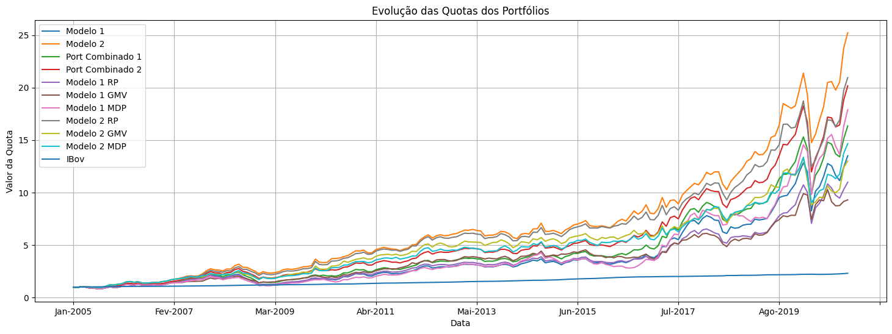
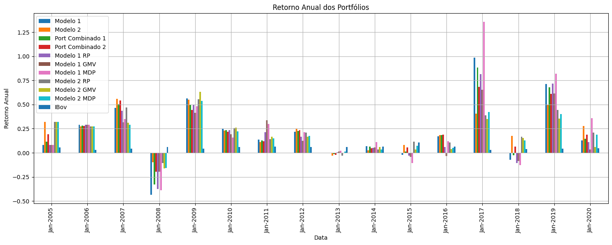
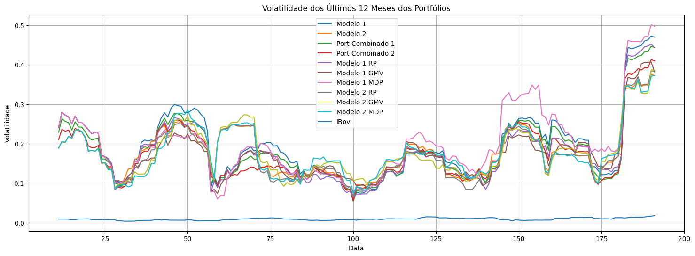

 

  
  <h3 align="center">Portfólios de Multifatores e Otimização</h3>
  

    Este repositório demonstra a aplicação de portfólios de multifatores, utilizando diferentes abordagens de otimização para maximizar o desempenho ajustado ao risco, comparando-os com o índice de referência IBovespa.
  

## Introdução à Teoria dos Portfólios de Multifatores
- Portfólios de Multifatores combinam diferentes fatores de risco que, historicamente, geram retornos superiores ao mercado e ajudam a reduzir o risco. Esses fatores incluem métricas como Qualidade (ROIC), Momentum, Valor, Tamanho, e Volatilidade.
- Ao incorporar múltiplos fatores, buscamos construir portfólios mais robustos, capazes de resistir a diferentes condições de mercado e, potencialmente, entregar retornos mais consistentes no longo prazo.

## Metodologia Aplicada
- O código em Python, localizado no notebook main.ipynb, realiza a coleta de dados de preços e fatores dos ativos listados no índice IBX a partir de 2005.
- Diversos fatores foram calculados e classificados, como ROIC, Momentum, Tamanho, Valor e Volatilidade, sendo posteriormente combinados para formar portfólios otimizados.
- A metodologia envolveu a criação de portfólios simples e combinados, seguidos da aplicação de técnicas de otimização, como a Otimização por Paridade de Risco (RP), Otimização do Portfólio de Mínima Variância Global (GMV), e Otimização por Desvio Mínimo de Volatilidade (MDP).

## Sobre o código
- Os dados históricos dos ativos e fatores são carregados de `arquivos Excel`, que foram exportados da `Economatica`, sendo então preparados para a análise subsequente.
- Em seguida são definidas funções para selecionar ações que compõem os portfólios baseados em rankings de fatores específicos, como `ROIC e Momentum`. Estas funções permitem a criação de portfólios utilizando um único fator ou a combinação de múltiplos fatores.
- A <strong>Otimização desses portifólios</strong> utiliza a biblioteca riskfolio-lib, o código aplica três diferentes métodos de otimização: Paridade de Risco (RP), Mínima Variância Global (GMV) e Desvio Mínimo de Volatilidade (MDP). Esses métodos ajudam a ajustar a composição dos portfólios para otimizar o retorno ajustado ao risco.
- Por fim, é realizada a <strong>combinação destes portifólios</strong>. Os portfólios otimizados são combinados em proporções específicas para criar novos portfólios híbridos. Esses portfólios são então avaliados e comparados com o índice de referência (IBov) para analisar sua performance relativa.

## Resultados e Gráficos
Após a construção e otimização dos portfólios, foram gerados gráficos comparativos de Evolução das Quotas, Retorno Anual, e Volatilidade dos últimos 12 meses para os portfólios analisados.

Gráfico da Evolução das Quotas dos Portfólios

  

Gráfico do Retorno Anual dos Portfólios

  

Gráfico da Volatilidade dos Últimos 12 Meses dos Portfólios

  

